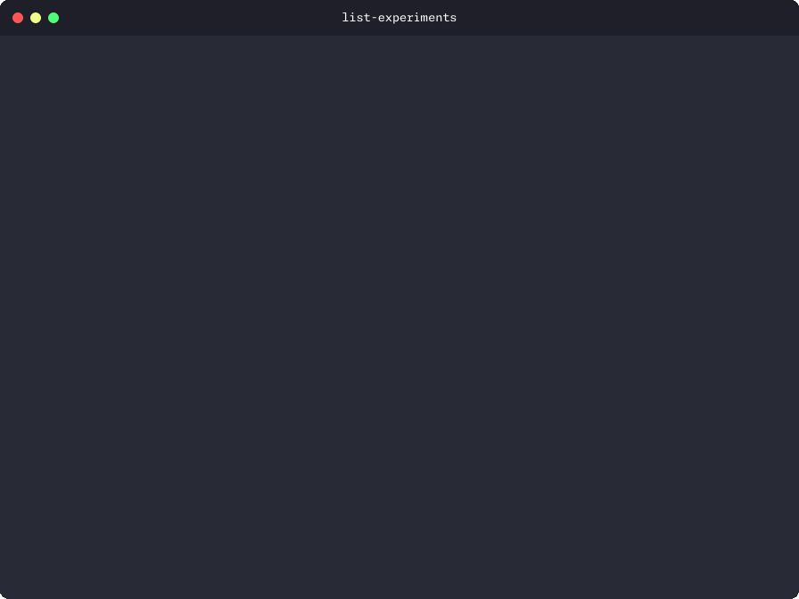
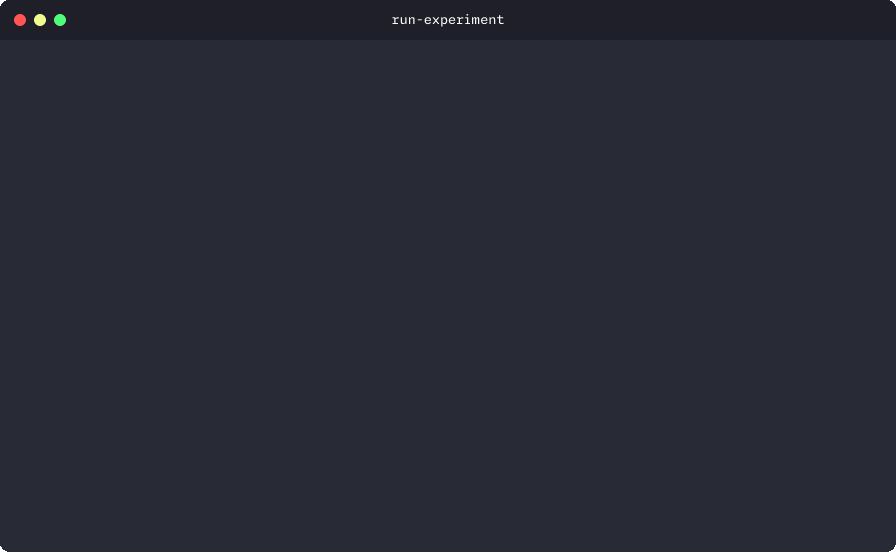
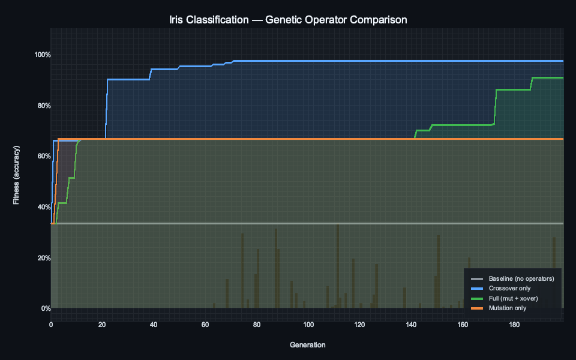
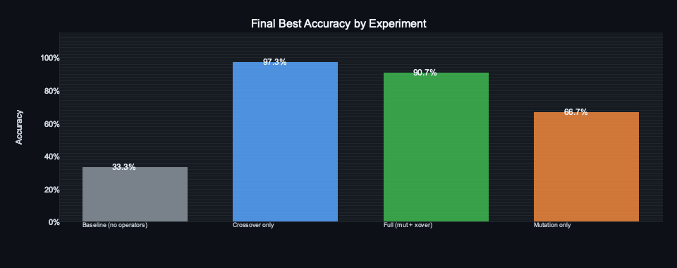

<p align="center">
  <h1 align="center">linear-gp</h1>
  <p align="center">
    A Rust framework for solving reinforcement learning and classification tasks using Linear Genetic Programming (LGP).
    <br /><br />
    <a href="https://github.com/urmzd/linear-gp/releases">Download</a>
    &middot;
    <a href="https://github.com/urmzd/linear-gp/issues">Report Bug</a>
    &middot;
    <a href="https://github.com/urmzd/linear-gp/tree/main/outputs">Experiments</a>
  </p>
</p>

<p align="center">
  <a href="https://github.com/urmzd/linear-gp/actions/workflows/ci.yml"></a>
  &nbsp;
  <a href="LICENSE"></a>
</p>

## Showcase

<table align="center">
  <tr>
    <td align="center">
      
      <br />
      <sub><b>Available Experiments</b></sub>
    </td>
    <td align="center">
      
      <br />
      <sub><b>Running an Experiment</b></sub>
    </td>
  </tr>
</table>

### Iris Classification — Operator Comparison

Comparison of four experiments (population 100, 200 generations, seed 42), each isolating a different genetic operator.

<p align="center">
  
</p>

<p align="center">
  
</p>

| Experiment | Operators | Final Accuracy | Description |
|------------|-----------|----------------|-------------|
| `iris_baseline` | None | 33.3% | Pure elitism — population converges to a single individual |
| `iris_mutation` | Mutation | 66.7% | Random instruction perturbation explores nearby program space |
| `iris_crossover` | Crossover | 97.3% | Two-point crossover recombines instruction sequences from fit parents |
| `iris_full` | Both | 90.7% | Full GP with mutation + crossover |

> Crossover dominates on this problem: recombining proven instruction subsequences is more effective than random perturbation. The shaded regions show the spread between worst and best fitness in each generation.

<details>
<summary><b>How It Works</b></summary>

<br>

```
┌─────────────────────────────────────────────────────────┐
│                    LGP Execution Model                  │
├─────────────────────────────────────────────────────────┤
│                                                         │
│  Input Features          Registers (r0..r3)             │
│  ┌──────────────┐        ┌─────┬─────┬─────┬─────┐     │
│  │ sepal_length │        │ r0  │ r1  │ r2  │ r3  │     │
│  │ sepal_width  │───────▶│Set. │Ver. │Vir. │Scr. │     │
│  │ petal_length │        └──┬──┴──┬──┴──┬──┴──┬──┘     │
│  │ petal_width  │           │     │     │     │         │
│  └──────────────┘           ▼     ▼     ▼     ▼         │
│                          ┌─────────────────────┐        │
│                          │  Execute N instrs   │        │
│                          │  r[s] = r[s] op x   │        │
│                          └─────────┬───────────┘        │
│                                    │                    │
│                                    ▼                    │
│                          ┌─────────────────────┐        │
│                          │  argmax(r0, r1, r2) │        │
│                          │  → predicted class   │        │
│                          └─────────────────────┘        │
│                                                         │
│  Instruction Modes:                                     │
│    Internal: r[src] = r[src] op r[tgt]                  │
│    External: r[src] = r[src] op (factor × input[tgt])   │
│                                                         │
└─────────────────────────────────────────────────────────┘
```

Each individual is a sequence of register-machine instructions. Programs operate on **4 registers** (r0-r2 map to Iris classes, r3 is scratch). After execution, the class with the highest action register value is the prediction. Programs are evolved through elitist selection, crossover, and mutation over generations.

</details>

<details>
<summary><b>Regenerate showcase</b></summary>

<br>

```bash
# Terminal GIFs (requires teasr: cargo install teasr-cli)
teasr showme

# Plotters charts (run all four experiments first)
lgp run iris_baseline --override hyperparameters.seed=42
lgp run iris_mutation --override hyperparameters.seed=42
lgp run iris_crossover --override hyperparameters.seed=42
lgp run iris_full --override hyperparameters.seed=42
cargo run -p lgp --example generate_showcase --features plot
```

</details>

## Contents

- [Overview](#overview)
- [Install](#install)
- [Quick Start](#quick-start)
- [CLI Reference](#cli-reference)
- [Performance](#performance)
- [Hyperparameter Search](#hyperparameter-search)
- [Visualizations](#visualizations)
- [Output Structure](#output-structure)
- [Logging](#logging)
- [Packages](#packages)
- [Extending the Framework](#extending-the-framework)
- [Thesis & References](#thesis--references)
- [Agent Skill](#agent-skill)
- [License](#license)

## Overview

Linear Genetic Programming (LGP) is a variant of genetic programming that evolves sequences of instructions operating on registers, similar to machine code. This framework provides:

- **Modular architecture** - Trait-based design for easy extension to new problem domains
- **Multiple problem types** - Built-in support for OpenAI Gym environments and classification tasks
- **Q-Learning integration** - Hybrid LGP + Q-Learning for enhanced reinforcement learning
- **Hyperparameter search** - Built-in random search with parallel evaluation
- **Parallel evaluation** - Rayon-powered parallel fitness evaluation
- **Experiment automation** - Full pipeline: search, run, and analyze from a single CLI
- **Optional plotting** - PNG chart generation via `plotters` (behind `--features plot`)

### Supported Environments

| Environment | Type | Inputs | Actions | Description |
|-------------|------|--------|---------|-------------|
| CartPole | RL | 4 | 2 | Balance a pole on a moving cart |
| MountainCar | RL | 2 | 3 | Drive a car up a steep mountain |
| Iris | Classification | 4 | 3 | Classify iris flower species |

## Install

**Prebuilt binary (recommended):**

```bash
curl -fsSL https://raw.githubusercontent.com/urmzd/linear-gp/main/install.sh | sh
```

You can pin a version or change the install directory:

```bash
LGP_VERSION=v1.0.0 LGP_INSTALL_DIR=~/.local/bin \
  curl -fsSL https://raw.githubusercontent.com/urmzd/linear-gp/main/install.sh | sh
```

**From source:**

```bash
git clone https://github.com/urmzd/linear-gp.git && cd linear-gp
cargo install --path crates/lgp-cli
```

## Quick Start

```bash
# List available experiments
lgp list

# Run CartPole with pure LGP
lgp run cart_pole_lgp

# Run Iris classification
lgp run iris_baseline

```

### Examples

Run the standalone Rust examples directly with cargo:

```bash
cargo run -p lgp-core --example cart_pole --features gym
cargo run -p lgp-core --example iris_classification
```

## CLI Reference

```bash
# Run experiment with default config
lgp run iris_baseline

# Run with optimal config (after search)
lgp run iris_baseline --config optimal

# Run with parameter overrides
lgp run iris_baseline --override hyperparameters.program.max_instructions=50

# Q-learning parameter overrides
lgp run cart_pole_with_q --override operations.q_learning.alpha=0.5

# Preview config (dry-run)
lgp run iris_baseline --dry-run

# Search hyperparameters
lgp search iris_baseline
lgp search iris_baseline --n-trials 20 --n-threads 8

# Analyze results (generates CSV tables + optional PNG plots)
lgp analyze
lgp analyze --input outputs --output outputs

# Run full experiment pipeline (search -> run -> analyze)
lgp experiment iris_baseline
lgp experiment iris_baseline --iterations 20
lgp experiment --skip-search
```

### Available Experiments

| Experiment | Description | Median run |
|------------|-------------|-----------:|
| `iris_baseline` | Iris baseline (no mutation, no crossover) | 0.21s |
| `iris_mutation` | Iris with mutation only | 0.37s |
| `iris_crossover` | Iris with crossover only | 1.19s |
| `iris_full` | Iris full (mutation + crossover) | 0.43s |
| `cart_pole_lgp` | CartPole with pure LGP | 0.15s |
| `cart_pole_with_q` | CartPole with Q-Learning | 0.16s |
| `mountain_car_lgp` | MountainCar with pure LGP | 2.06s |
| `mountain_car_with_q` | MountainCar with Q-Learning | 2.23s |

## Performance

Wall-clock times for `lgp run <experiment> --override hyperparameters.seed=42` with the bundled default configs, built with `cargo build --release`. Fitness evaluation is parallelized across the population via `rayon`, so numbers scale with core count.

**Hardware:** Apple M4 Pro (12 cores), 24 GB RAM, macOS. **Samples:** n=100 per experiment.

| Experiment | min | median | mean | p95 | max |
|------------|----:|-------:|-----:|----:|----:|
| `iris_baseline` | 0.15s | 0.21s | 0.21s | 0.24s | 0.25s |
| `iris_mutation` | 0.10s | 0.37s | 0.34s | 0.48s | 0.57s |
| `iris_crossover` | 0.20s | 1.19s | 1.28s | 2.51s | 3.56s |
| `iris_full` | 0.13s | 0.43s | 0.41s | 0.66s | 0.84s |
| `cart_pole_lgp` | 0.14s | 0.15s | 0.16s | 0.16s | 0.49s |
| `cart_pole_with_q` | 0.16s | 0.16s | 0.16s | 0.17s | 0.18s |
| `mountain_car_lgp` | 1.54s | 2.06s | 2.20s | 2.92s | 4.54s |
| `mountain_car_with_q` | 1.69s | 2.23s | 2.40s | 3.30s | 4.78s |

Running all 8 experiments sequentially takes ≈ 7s at the medians. `iris_crossover` has the widest spread — recombining variable-length programs produces runs with meaningfully more instructions to execute. MountainCar dominates wall-clock time because episodes run the full 200-step default, while CartPole episodes terminate early when the pole falls.

## Hyperparameter Search

The framework includes built-in hyperparameter search with parallel evaluation via `rayon`.

```bash
# Search for a specific config
lgp search cart_pole_lgp

# Search all configs (LGP first, then Q-Learning)
lgp search

# Search with custom options
lgp search cart_pole_with_q --n-trials 100 --n-threads 8 --median-trials 15
```

### Parameters Searched

| Parameter | Range |
|-----------|-------|
| `max_instructions` | 1-100 |
| `external_factor` | 0.0-100.0 |
| `alpha` (Q-Learning) | 0.0-1.0 |
| `gamma` (Q-Learning) | 0.0-1.0 |
| `epsilon` (Q-Learning) | 0.0-1.0 |
| `alpha_decay` (Q-Learning) | 0.0-1.0 |
| `epsilon_decay` (Q-Learning) | 0.0-1.0 |

Results are saved to:
- `outputs/parameters/<config>.json`
- `configs/<config>/optimal.toml`

## Visualizations

```bash
# Analyze results (generates CSV tables)
lgp analyze

# Build with plot feature for PNG chart generation
cargo install --path crates/lgp-cli --features plot
lgp analyze
```

## Output Structure

```
outputs/
├── parameters/                 # Optimized hyperparameters (JSON)
│   ├── cart_pole_lgp.json
│   └── ...
├── <experiment>/               # Experiment outputs (timestamped runs)
│   └── <timestamp>/
│       ├── config/
│       │   └── config.toml     # Resolved config with seed/timestamp
│       ├── outputs/
│       │   ├── best.json       # Best individual from final generation
│       │   ├── median.json     # Median individual
│       │   ├── worst.json      # Worst individual
│       │   ├── population.json # Full population history
│       │   └── params.json     # Hyperparameters used
│       └── post_process/       # Post-processing outputs
├── tables/                     # Generated CSV statistics
│   └── <experiment>.csv
└── figures/                    # Generated PNG plots (with --features plot)
    └── <experiment>.png
```

## Logging

```bash
# Default (info level, pretty format)
lgp run iris_baseline

# Verbose mode (debug level)
lgp -v run iris_baseline

# JSON format for log aggregation
lgp --log-format json run iris_baseline

# Fine-grained control via RUST_LOG
RUST_LOG=lgp=debug lgp run iris_baseline
RUST_LOG=lgp::core=trace,lgp=info lgp run iris_baseline
```

| Level | Use Case |
|-------|----------|
| `error` | Fatal issues only |
| `warn` | Potential problems |
| `info` | Progress updates (default) |
| `debug` | Detailed diagnostics |
| `trace` | Instruction-by-instruction execution |

## Packages

| Package | Description |
|---------|-------------|
| [lgp-core](crates/lgp/README.md) | Core library — traits, evolutionary engine, built-in problems |
| [lgp](crates/lgp-cli/README.md) | CLI binary for running experiments, search, and analysis |

## Extending the Framework

The framework is built around these key traits:

- **`State`** - Represents an environment state with value access and action execution
- **`RlState`** - Extends State for RL environments with terminal state detection
- **`Core`** - Main trait defining the genetic algorithm components
- **`Fitness`** - Evaluates individual performance on states
- **`Breed`** - Two-point crossover for creating offspring
- **`Mutate`** - Mutation operators for genetic variation

You can add new classification problems, RL environments, genetic operators, and fitness functions. See [skills/lgp-experiment/SKILL.md](skills/lgp-experiment/SKILL.md) for the complete guide.

## Thesis & References

The accompanying thesis, *Reinforced Linear Genetic Programming*, and full references are maintained in a [separate repository](https://github.com/urmzd/rlgp-thesis).

## Agent Skill

This repo's conventions are available as portable agent skills in [`skills/`](skills/).

## License

[Apache-2.0](LICENSE)
