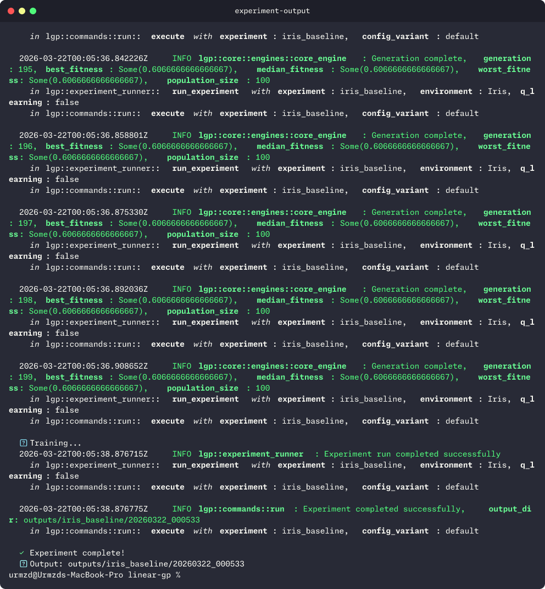

<p align="center">
  <h1 align="center">linear-gp</h1>
  <p align="center">
    A Rust framework for solving reinforcement learning and classification tasks using Linear Genetic Programming (LGP).
    <br /><br />
    <a href="https://github.com/urmzd/linear-gp/releases">Download</a>
    &middot;
    <a href="https://github.com/urmzd/linear-gp/issues">Report Bug</a>
    &middot;
    <a href="https://github.com/urmzd/linear-gp/tree/main/outputs">Experiments</a>
  </p>
</p>

<p align="center">
  <a href="https://github.com/urmzd/linear-gp/actions/workflows/ci.yml"></a>
</p>

## Showcase

<p align="center">
  
</p>

## Overview

Linear Genetic Programming (LGP) is a variant of genetic programming that evolves sequences of instructions operating on registers, similar to machine code. This framework provides:

- **Modular architecture** - Trait-based design for easy extension to new problem domains
- **Multiple problem types** - Built-in support for OpenAI Gym environments and classification tasks
- **Q-Learning integration** - Hybrid LGP + Q-Learning for enhanced reinforcement learning
- **Hyperparameter search** - Built-in random search with parallel evaluation
- **Parallel evaluation** - Rayon-powered parallel fitness evaluation
- **Experiment automation** - Full pipeline: search, run, and analyze from a single CLI
- **Optional plotting** - PNG chart generation via `plotters` (behind `--features plot`)

### Supported Environments

| Environment | Type | Inputs | Actions | Description |
|-------------|------|--------|---------|-------------|
| CartPole | RL | 4 | 2 | Balance a pole on a moving cart |
| MountainCar | RL | 2 | 3 | Drive a car up a steep mountain |
| Iris | Classification | 4 | 3 | Classify iris flower species |

## Quick Start

### Prerequisites

| Dependency | Version | Installation |
|------------|---------|--------------|
| Rust | 1.70+ | [rustup.rs](https://rustup.rs/) |
| just | Latest | `cargo install just` |

**macOS:**
```bash
brew install rust
cargo install just
```

**Ubuntu:**
```bash
curl --proto '=https' --tlsv1.2 -sSf https://sh.rustup.rs | sh
cargo install just
```

### Installation

```bash
# Clone the repository
git clone https://github.com/urmzd/linear-gp.git
cd linear-gp

# Build and install git hooks
just init
```

### First Experiment

```bash
# List available experiments
just list

# Run CartPole with pure LGP
just run cart_pole_lgp

# Run Iris classification
just run iris_baseline

# Run an example
just run-example cart_pole

# Run benchmarks
just bench
```

## Packages

| Package | Path | Description |
|---------|------|-------------|
| [lgp](crates/lgp/README.md) | `crates/lgp` | Core Rust library — traits, evolutionary engine, built-in problems |
| [lgp-cli](crates/lgp-cli/README.md) | `crates/lgp-cli` | CLI binary (`lgp`) for running experiments, search, and analysis |

## Project Architecture

```
linear-gp/
├── crates/
│   ├── lgp/                    # Core LGP library
│   │   ├── src/
│   │   │   ├── lib.rs          # Library exports
│   │   │   ├── core/           # Core LGP implementation
│   │   │   ├── problems/       # Problem implementations
│   │   │   ├── extensions/     # Extended functionality
│   │   │   └── utils/          # Utility functions
│   │   ├── benches/            # Performance benchmarks
│   │   └── tests/              # Integration tests
│   └── lgp-cli/                # CLI application
│       └── src/
│           ├── main.rs         # CLI entry point
│           ├── commands/       # Subcommands (run, list, search, analyze, experiment)
│           ├── config_discovery.rs
│           ├── config_override.rs
│           └── experiment_runner.rs
├── configs/                    # Experiment configurations
│   ├── iris_baseline/default.toml
│   ├── cart_pole_lgp/default.toml
│   └── ...
├── outputs/                    # Experiment outputs
│   ├── parameters/             # Optimized hyperparameters (JSON)
│   ├── <experiment>/           # Per-experiment outputs
│   │   └── <timestamp>/        # Timestamped runs
│   ├── tables/                 # CSV statistics
│   └── figures/                # PNG plots
└── skills/                     # Agent skills & documentation
```

### Core Traits

The framework is built around these key traits:

- **`State`** - Represents an environment state with value access and action execution
- **`RlState`** - Extends State for RL environments with terminal state detection
- **`Core`** - Main trait defining the genetic algorithm components
- **`Fitness`** - Evaluates individual performance on states
- **`Breed`** - Two-point crossover for creating offspring
- **`Mutate`** - Mutation operators for genetic variation

See [skills/lgp-experiment/SKILL.md](skills/lgp-experiment/SKILL.md#core-traits) for detailed trait documentation.

## Logging and Tracing

The framework includes comprehensive structured logging via the [tracing](https://docs.rs/tracing) ecosystem.

### Quick Start

```bash
# Default (info level, pretty format)
lgp run iris_baseline

# Verbose mode (debug level)
lgp -v run iris_baseline

# JSON format for log aggregation
lgp --log-format json run iris_baseline
```

### Environment Variables

| Variable | Description | Example |
|----------|-------------|---------|
| `RUST_LOG` | Control log level filtering | `lgp=debug`, `lgp=trace` |
| `LGP_LOG_FORMAT` | Override output format | `pretty`, `compact`, `json` |

### Log Level Guide

| Level | Use Case | Example Output |
|-------|----------|----------------|
| `error` | Fatal issues only | Panics, unrecoverable errors |
| `warn` | Potential problems | Deprecated features, suspicious values |
| `info` | Progress updates (default) | Generation stats, experiment start/complete |
| `debug` | Detailed diagnostics | Config loading, individual fitness scores |
| `trace` | Very verbose | Instruction execution, Q-table updates |

### Examples

```bash
# Debug level for LGP crate only
RUST_LOG=lgp=debug lgp run iris_baseline

# Trace level (very verbose - instruction-by-instruction)
RUST_LOG=lgp=trace lgp run iris_baseline

# Different levels for different modules
RUST_LOG=lgp::core=trace,lgp=info lgp run iris_baseline

# JSON output for log aggregation (ELK, Datadog, etc.)
lgp --log-format json run iris_baseline 2>&1 | jq .
```

## CLI Reference

```bash
# List available experiments
lgp list

# Run experiment with default config
lgp run iris_baseline

# Run with optimal config (after search)
lgp run iris_baseline --config optimal

# Run with overrides
lgp run iris_baseline --override hyperparameters.program.max_instructions=50

# Q-learning parameter overrides
lgp run cart_pole_with_q --override operations.q_learning.alpha=0.5

# Preview config (dry-run)
lgp run iris_baseline --dry-run

# Search hyperparameters
lgp search iris_baseline
lgp search iris_baseline --n-trials 20 --n-threads 8

# Analyze results (generates CSV tables + optional PNG plots)
lgp analyze
lgp analyze --input outputs --output outputs

# Run full experiment pipeline (search -> run -> analyze)
lgp experiment iris_baseline
lgp experiment iris_baseline --iterations 20
lgp experiment --skip-search

# Run a Rust example
lgp example cart_pole

# List available examples
lgp example --list
```

**Available Experiments:**

| Experiment | Description |
|------------|-------------|
| `iris_baseline` | Iris baseline (no mutation, no crossover) |
| `iris_mutation` | Iris with mutation only |
| `iris_crossover` | Iris with crossover only |
| `iris_full` | Iris full (mutation + crossover) |
| `cart_pole_lgp` | CartPole with pure LGP |
| `cart_pole_with_q` | CartPole with Q-Learning |
| `mountain_car_lgp` | MountainCar with pure LGP |
| `mountain_car_with_q` | MountainCar with Q-Learning |

## Hyperparameter Search

The framework includes built-in hyperparameter search with parallel evaluation via `rayon`.

### Running Search

```bash
# Search for a specific config
lgp search cart_pole_lgp

# Search all configs (LGP first, then Q-Learning)
lgp search

# Search with custom options
lgp search cart_pole_with_q --n-trials 100 --n-threads 8 --median-trials 15
```

### Parameters Searched

| Parameter | Range |
|-----------|-------|
| `max_instructions` | 1-100 |
| `external_factor` | 0.0-100.0 |
| `alpha` (Q-Learning) | 0.0-1.0 |
| `gamma` (Q-Learning) | 0.0-1.0 |
| `epsilon` (Q-Learning) | 0.0-1.0 |
| `alpha_decay` (Q-Learning) | 0.0-1.0 |
| `epsilon_decay` (Q-Learning) | 0.0-1.0 |

Results are saved to:
- `outputs/parameters/<config>.json`
- `configs/<config>/optimal.toml`

## Running Experiments

### Quick Start with Just

```bash
# List available experiments
just list

# Run individual experiments
just run cart_pole_lgp
just run cart_pole_with_q
just run mountain_car_lgp
just run iris_baseline

# Run with dry-run to preview config
just run iris_baseline --dry-run
```

### Running with lgp

```bash
# Run with default config
lgp run cart_pole_lgp

# Run with optimized config (after search)
lgp run cart_pole_lgp --config optimal

# Run with parameter overrides
lgp run cart_pole_lgp --override hyperparameters.n_generations=200
```

### Generating Visualizations

```bash
# Analyze results (generates CSV tables)
lgp analyze

# Build with plot feature for PNG chart generation
cargo build --release --features plot
lgp analyze
```

### Output Structure

```
outputs/
├── parameters/                 # Optimized hyperparameters (JSON)
│   ├── cart_pole_lgp.json
│   └── ...
├── <experiment>/               # Experiment outputs (timestamped runs)
│   └── <timestamp>/            # e.g., 20260201_083623
│       ├── config/
│       │   └── config.toml     # Resolved config with seed/timestamp
│       ├── outputs/
│       │   ├── best.json       # Best individual from final generation
│       │   ├── median.json     # Median individual
│       │   ├── worst.json      # Worst individual
│       │   ├── population.json # Full population history
│       │   └── params.json     # Hyperparameters used
│       └── post_process/       # Post-processing outputs
├── tables/                     # Generated CSV statistics
│   └── <experiment>.csv
└── figures/                    # Generated PNG plots (with --features plot)
    └── <experiment>.png

configs/
└── <experiment>/
    ├── default.toml            # Default configuration
    └── optimal.toml            # Generated by search
```

## Extending the Framework

The framework is designed to be extensible. You can add:

- New classification problems (e.g., XOR, MNIST)
- New RL environments (custom or gym-rs compatible)
- Custom genetic operators (mutation, crossover)
- Alternative fitness functions

See the [Quick Start](skills/lgp-experiment/SKILL.md#extension-quick-start) for a minimal example, or [skills/lgp-experiment/SKILL.md](skills/lgp-experiment/SKILL.md) for the complete guide.

## Agent Skill

This project ships an [Agent Skill](https://github.com/vercel-labs/skills) for use with Claude Code, Cursor, and other compatible agents.

Available as portable agent skills in [`skills/`](skills/).

Once installed, use `/lgp-experiment` to run experiments, tune hyperparameters, and analyze results.

## Contributing

Contributions are welcome! Please see [CONTRIBUTING.md](CONTRIBUTING.md) for:

- Development setup instructions
- Code style guidelines
- Testing requirements
- Pull request process

## Thesis

The accompanying thesis, *Reinforced Linear Genetic Programming*, is maintained in a [separate repository](https://github.com/urmzd/rlgp-thesis).

## References

### Genetic Programming

- Koza, J. R. (1993). *Genetic Programming: On the Programming of Computers by Means of Natural Selection*. MIT Press.
- Poli, R., Langdon, W. B., & McPhee, N. F. (2008). *A Field Guide to Genetic Programming*. lulu.com. http://www.gp-field-guide.org.uk/
- Luke, S. (2009). *Essentials of Metaheuristics*. Lulu. https://cs.gmu.edu/~sean/book/metaheuristics/

### Linear Genetic Programming

- Brameier, M., & Banzhaf, W. (2001). A Comparison of Linear Genetic Programming and Neural Networks in Medical Data Mining. *IEEE Transactions on Evolutionary Computation*, 5(1), 17-26.
- Song, D., Heywood, M. I., & Zincir-Heywood, A. N. (2003). A Linear Genetic Programming Approach to Intrusion Detection. In *GECCO 2003*, LNCS 2724, pp. 2325-2336. Springer.
- Peeler, H., Li, S. S., Sloss, A. N., Reid, K. N., Yuan, Y., & Banzhaf, W. (2022). Optimizing LLVM Pass Sequences with Shackleton: A Linear Genetic Programming Framework. In *GECCO 2022 Companion*, pp. 578-581. ACM.

### Reinforcement Learning

- Sutton, R. S., & Barto, A. G. (2018). *Reinforcement Learning: An Introduction* (2nd ed.). MIT Press.
- Downing, H. L. (1995). Reinforced Genetic Programming. In *Proceedings of the Sixth International Conference on Genetic Algorithms (ICGA95)*, pp. 276-283.
- Amaral, R., Ianta, A., Bayer, C., Smith, R. J., & Heywood, M. I. (2022). Benchmarking Genetic Programming in a Multi-Action Reinforcement Learning Locomotion Task. In *GECCO 2022 Companion*, pp. 522-525. ACM.

### Environments & Datasets

- Brockman, G., Cheung, V., Pettersson, L., Schneider, J., Schulman, J., Tang, J., & Zaremba, W. (2016). OpenAI Gym. arXiv:1606.01540.
- Fisher, R. A. (1936). The Use of Multiple Measurements in Taxonomic Problems. *Annals of Eugenics*, 7(2), 179-188.
